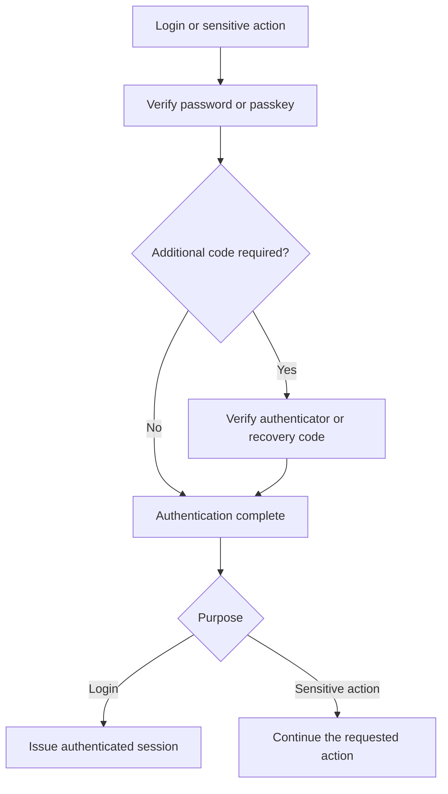

# Security: agreed behavior and shared-flow design

Status: approved design implemented in ACT-51. See [Accounts](accounts.md)
for the account checkpoint and [Security implementation](security.md) for the
API, persistence contracts, operational requirements and validation limits.

## Scope and presentation

Add **Security** beside Profile in User Settings, at `/user-settings/security`.
The page has four sections, in order: Password, Passkeys, Authenticator, Sessions.
Recovery codes and the passkey extra-code preference belong in Authenticator.
Keep the existing sign-in visual language, accessibility and reduced-motion
behavior. Enrollment and verification are shared flows presented in modals from
Security and within the login experience where appropriate.

This batch includes password changes, session listing/revocation, passkey login
and management, authenticator-app MFA, recovery codes, and the post-login passkey
invitation. Design and implement them together so their policies and UI agree.

“Session” means authenticated access. Future CLI sign-ins belong in the same
list and revocation scope; their login mechanism and expiry are later work.
Agent conversations/runs will be called **threads**, with a separate lifecycle.
Long-lived API credentials are also future work, distinct from sessions.

## Shared authentication policy

Standalone passkey authentication requires authenticator user verification
(PIN or biometric verification). Acta must request it and validate the signed
verification flag, as well as the normal WebAuthn assertion checks.

| Account configuration | Password sign-in | Passkey sign-in |
| --- | --- | --- |
| Authenticator not enabled | Password | Verified passkey |
| Authenticator enabled, extra code after passkey off | Password + authenticator code | Verified passkey |
| Authenticator enabled, extra code after passkey on | Password + authenticator code | Verified passkey + authenticator code |

A recovery code may replace an authenticator code wherever it is required. It
does not replace the password or passkey and does not sign someone in by itself.
It is single-use; using it does not disable MFA or change the extra-code policy.

The same policy governs fresh authentication for sensitive actions. In
particular, changing the extra-code preference must satisfy the policy that is
currently enabled, not the weaker policy being requested.

Fresh authentication is reusable for five minutes, bound to the current session
and the proofs actually verified. Ordinary browsing does not refresh it. A
completed login may satisfy this requirement; merely entering a correct
password while an MFA step remains cannot. Changing a password always retains
its explicit current-password field, even when other recent proof is available.

## Authentication and action flows

These transitions describe shared behavior, not separate login/settings code.

A sensitive action may enter at Authentication complete when its session has
fresh proof satisfying the current policy. The server makes that decision.
Login always proves identity before a new session is issued. Account identity
cannot change halfway through a flow.

For login, a correct first factor with pending MFA produces only a restricted
authentication flow. It grants no application access. When all proof succeeds,
session issuance and completion of that flow happen atomically. Existing
same-browser session replacement behavior is retained at successful completion.

For sensitive actions, an existing authenticated session identifies the account.
The flow verifies any missing proof, collects action-specific inputs, and commits
only the action that was authorized. Expired proof or changed security state
must return to verification or require restarting; the client cannot skip steps.

### Password

The Password section opens a **Change password** modal containing current
password, new password, and the submit action. Reuse existing
password rules and password-field behavior. Verify the current password and any
additional proof required by the account policy, then update the credential and
revoke every other session in one transaction. Keep this browser signed in.

### Passkeys

Show each passkey's user-chosen name, creation date, last-used time (or never
used), and **Remove**. **New passkey** opens this mini-flow:

1. Satisfy fresh authentication.
2. Explain the browser handoff and collect a name.
3. Start the browser's credential-creation ceremony.
4. Verify and store the credential on the server, then show success.

Cancelling the browser prompt returns to the modal for retry. Cancelling or
expiring the Acta flow before completion stores no usable credential in Acta.
If the authenticator created a credential but the server never accepted it,
it is not an Acta sign-in method; show an honest retry/error state.

Removing a passkey requires fresh authentication under the current policy and
revokes other sessions. Adding one does not revoke sessions. Support multiple
passkeys. Password removal/passwordless account conversion is outside this batch.

The login page offers **Sign in with a passkey**. After a fully completed
password login, offer passkey creation with **Create a passkey** and **Not now**.
Do not automatically launch the browser ceremony. Do not offer this suggestion
after passkey login. Remember dismissal or successful creation for that account
in that browser, not as a server-side account preference. Another browser may
still offer it. Cancelling creation alone does not count as successful creation.

The invitation invokes exactly the same creation flow as New passkey in Security.
A recent completed login satisfies its initial authentication step when policy
allows. The invitation is optional and does not hold the signed-in user captive.

### Authenticator enrollment and replacement

One authenticator configuration per account, using authenticator-app codes.
The enrollment modal shows a QR code and a manual setup key. Fresh authentication
precedes setup. Verify a code from the proposed authenticator, then present ten
single-use recovery codes and require acknowledgement that they have been saved.
Only then enable MFA. Cancelling before completion leaves protection unchanged.

Replacement uses the same enrollment steps after fresh authentication under the
existing policy. Keep the old authenticator and recovery codes working until
the new configuration is verified and its recovery codes acknowledged. At commit,
replace the configuration and recovery-code set together and revoke other
sessions. No intermediate state disables protection.

Disabling MFA also requires current-policy fresh authentication. Remove its
authenticator and recovery codes, clear the extra-code preference, and revoke
other sessions atomically. A future enrollment starts with the default preference.

Once MFA is enabled, show **Require an authenticator code after passkey sign-in**,
off by default. Changing it requires current-policy fresh authentication and
revokes other sessions. Enabling MFA also revokes other sessions. The initiating
browser stays signed in for these changes.

### Recovery codes

Show how many remain, never the previously issued plaintext codes. **Generate
new codes** requires fresh authentication and presents a new set for saving.
Replacing the set invalidates all previous codes. Use the same code presentation
and acknowledgement UI as enrollment, including copy/download support.

Agreed transaction detail: prepare the replacement codes in the
restricted flow and replace the active set at acknowledgement. Cancelling before
that commit preserves the existing set, matching authenticator replacement.
The codes are never a replacement for the first sign-in factor.

### Sessions

Show the list directly for the expected small number of sessions. Each row has
browser/OS description, sign-in time and last activity. Clearly mark **This
session**. Descriptions are approximate labels, not proof of device identity.
Omit IP addresses and location in this pass.

Other rows offer **Sign out**, with **Sign out all other sessions** for the group.
The current session uses the existing Log out action. Revocation is enforced on
the next server request. Keep the existing seven-day inactivity and 30-day
absolute browser limits. Tabs sharing a login cookie share a session; another
browser/device sign-in has its own session. Future CLI sessions participate in
the same list and “other sessions” operations without inheriting browser expiry
by accident.

| Successful action | Effect on other sessions |
| --- | --- |
| Change password | Revoke all |
| Add passkey | Keep |
| Remove passkey | Revoke all |
| Enable, replace or disable authenticator | Revoke all |
| Change extra-code-after-passkey preference | Revoke all |
| Generate replacement recovery codes | Keep; invalidate previous codes |
| Sign out one / all other sessions | Revoke the selected scope |

## Implementation structure

Keep this purpose-built for authentication rather than making a general workflow
engine. Three responsibilities must be shared:

- **Policy:** determine acceptable proof for a purpose from the current security
  configuration and the session's verified methods and timestamps.
- **Flows:** server-owned, expiring state for verification, passkey ceremonies,
  authenticator enrollment and recovery-code presentation/consumption.
- **UI:** reusable verification, password, code entry, passkey browser handoff,
  authenticator setup and recovery-code steps. Page/modal hosts provide context,
  headings and completion destinations, not alternate security implementations.

Keep policy and flow transitions in the authentication domain; keep PostgreSQL
transactions behind behavioral storage contracts; keep HTTP responsible for
transport and cookie/origin handling. Shared UI follows authoritative server
state. Flow tokens are opaque and constrained to their purpose, account and
browser/session context; partial flows are not normal authentication cookies.

The implementation must address these invariants before it is considered ready:

- Validate every WebAuthn challenge, origin, RP ID, credential/account binding
  and required user verification on the server. A successful browser callback
  is not sufficient evidence.
- Consume challenges and recovery codes atomically. Reject replayed authenticator
  codes within their accepted time window. Bound attempts and expiry across
  server instances, reusing the existing shared-throttling approach.
- Bind proof to the verified methods, not a single `recently_authenticated` flag.
  Recheck policy and credential validity at commit. Security changes invalidate
  stale flow authorization, including login flows started before the change.
- Coordinate session issuance with credential/policy changes and revocation so
  an in-flight old login cannot create a surviving session after a reset.
- Keep MFA secret storage and key handling explicit. Store recovery-code/token
  digests, never put secrets in event records or ordinary logs, and prevent
  caching of enrollment and recovery-code responses.
- Keep factor changes, recovery-code replacement, authorization consumption and
  required session revocation atomic. Concurrent flows must not overwrite newer
  security configuration or weaken it through stale requests.
- Preserve existing UUID account identity, active-account checks, CSRF/cookie
  protections and audit/event behavior. Public account data must not expose
  private credential metadata or authentication-flow state.
- Treat cancellation, retry, timeout, browser unsupported/cancelled ceremonies,
  field errors and lost network responses as normal shared-flow states. Never
  report success before the server committed the action.

Concrete APIs, schema, WebAuthn library selection, enrollment-flow lifetimes,
and MFA secret encryption/key provisioning are implementation design work, not
additional agreed product features. Validate them against these contracts.

## Recovery and administration

Site Settings now provides admin-issued invitation and recovery links; see
[User management](user-management.md). Share
token handling and password-setting UI, but retain explicit grant purposes.
New accounts are pending activation with no password credential, not active
accounts whose missing password implicitly defines their state.

The admin password-reset modal offers **Also disable MFA**, off by default.
Only successful redemption applies the authorized changes; generating an unused
link must not weaken the account. A normal password reset does not disable MFA.
Links are random, expiring, single-use and bound to account UUID and scope.
Direct permissions and required-MFA enrolment are now implemented; see
[Permissions](permissions.md). Group-derived requirements are documented in [Groups](groups.md).

Recovery for a locked-out sole administrator remains unresolved and deferred.
This batch must not present recovery codes as a full solution to losing every
credential and every recovery code. No hidden bypass is implied by this design.

## Validation plan

Test policy as a matrix across password/passkey, MFA on/off, extra-code preference,
normal/recovery code and fresh/stale proof. Exercise domain transitions and real
PostgreSQL races: double redemption, concurrent replacement, policy changes during
login, revocation versus session creation, and cancellation before commit.

Review the shared flows from both login and Security on 8081, including keyboard
and screen-reader semantics, modal focus restoration, mobile layout, light/dark
themes, cancellation/retry, error recovery, and browser-local invitation behavior.
Use real browser/authenticator checks where possible and clearly distinguish them
from protocol fixtures and automated tests. Do not claim a fixture proves that a
real device ceremony or a particular browser works.

## References

- [WebAuthn user-verification requirement](https://www.w3.org/TR/webauthn-3/#enum-userVerificationRequirement).
- [OWASP MFA lifecycle and recovery guidance](https://cheatsheetseries.owasp.org/cheatsheets/Multifactor_Authentication_Cheat_Sheet.html).
- [OWASP password recovery guidance](https://cheatsheetseries.owasp.org/cheatsheets/Forgot_Password_Cheat_Sheet.html).
